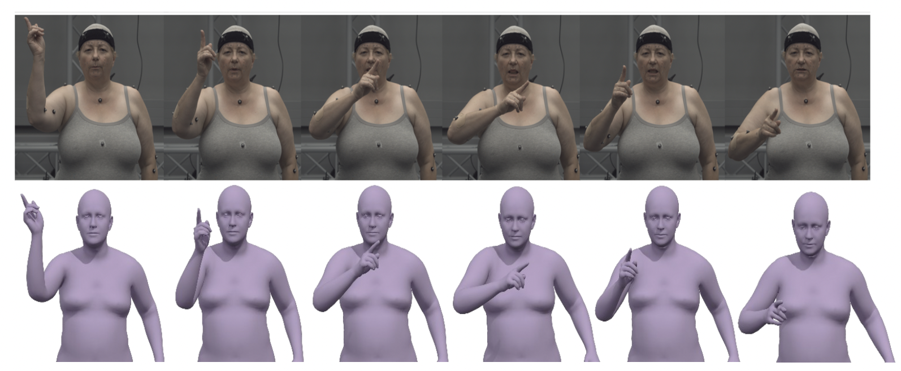
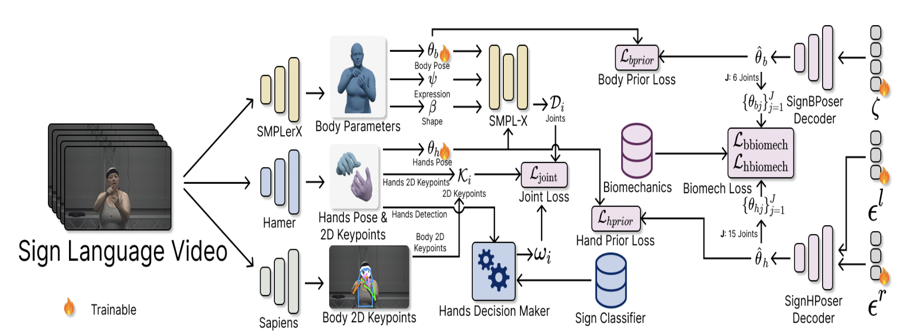

# We will release the pretrained models soon!!

# DexAvatar: 3D Sign Language Reconstruction with Hand and Body Pose Priors [WACV 2026]

The official repository of the paper with supplementary: [DexAvatar](https://arxiv.org/abs/2512.21054)

~~~
conda create -n dexavatar -y python=3.10
conda activate dexavatar
bash scripts/env_install.sh
bash scripts/bug_fix_dexavatar.sh
conda deactivate
~~~
Download the signfy frames, from [this link](https://sgnify.is.tue.mpg.de/download.php) and place them in the ./data folder. 

The folder structure should be as follows:

~~~

data/
└── images_sgnify/
    ├── sign1/
    │   └── Images/
    │       ├── Img1.png
    │       ├── Img2.png
    │       └── ...
    ├── sign2/
    │   └── Images/
    │       ├── Img1.png
    │       ├── Img2.png
    │       └── ...
    └── ...

~~~

The sign segmentations and the corresponding classes for each sign are already present in the ./data folder for SGNify dataset. If you want to have your own sign segmentations and classes for each sign, please generate them from the previous work in [this link](https://github.com/MPForte/SGNify).

## About the project

This project is carried out at the [Human-Centered AI Lab](https://www.monash.edu/it/hcc/human-centred-ai-lab) in the [Faculty of Information Technology](https://www.monash.edu/it), [Monash University, Melbourne (Clayton), Australia](https://www.monash.edu/).

Project Members -

[Kaustubh Kundu](https://scholar.google.com/citations?user=DkDGWCYAAAAJ&hl=en) [(Monash University, Melbourne, Australia)](https://www.monash.edu/),                                                                                                                                                     
[Hrishav Bakul Barua](https://www.researchgate.net/profile/Hrishav-Barua)  [(Monash University and TCS Research, Kolkata, India)](https://www.tcs.com/what-we-do/research),                                                                                                                   
[Lucy Robertson-Bell](https://research.monash.edu/en/persons/lucy-marde-robertson-bell/) [(Monash University, Melbourne, Australia)](https://www.monash.edu/),                                                                                                                                           
[Zhixi Cai](https://scholar.google.com/citations?user=-rpiDIoAAAAJ&hl=zh-CN) [(Monash University, Melbourne, Australia)](https://www.monash.edu/), and                                                                                                                                                   
[Kalin Stefanov](https://research.monash.edu/en/persons/kalin-stefanov) [(Monash University, Melbourne, Australia)](https://www.monash.edu/)    

### <ins>Funding details<ins>

This work is supported by the prestigious [`Discovery Early Career Researcher Award (DECRA)`
](https://www.arc.gov.au/funding-research/funding-schemes/discovery-program/discovery-early-career-researcher-award-decra) fellowship by [`Australian Research Council (ARC)`](https://www.arc.gov.au/) `[Grant no. DE230100049 | Project: Towards automated Australian Sign Language translation]`. We also acknowledge Monash University (M3 Cluster) and
National Computational Infrastructure (NCI) for providing High Performance Computing (HPC) to carry out experiments.

## Overview

The trend in sign language generation is centered around
data-driven generative methods. These methods require
vast amounts of precise 2D and 3D human pose data to
achieve a generation quality acceptable to the Deaf com-
munity. However, currently, most sign language datasets
are video-based and limited to automatically reconstructed
2D human poses (i.e., keypoints) and lack accurate 3D in-
formation. However, manual production of accurate 2D
and 3D human pose information from videos is a labor-
intensive process. Furthermore, existing state-of-the-art for
automatic 3D human pose estimation from sign language
videos is prone to self-occlusion, noise, and motion blur ef-
fects, resulting in poor reconstruction quality. In response
to this, we introduce DexAvatar, a novel framework to re-
construct bio-mechanically accurate fine-grained hand ar-
ticulations and body movements from in-the-wild monocu-
lar sign language videos, guided by learned 3D hand and
body priors. DexAvatar achieves strong performance in the
SGNify motion capture dataset, the only benchmark avail-
able for this task, reaching an improvement of 35.11% in the estimation of body and hand poses compared to the state-
of-the-art.

### Overall Architecture

## Qualitative Results (check out the videos!!)

https://github.com/user-attachments/assets/923c3181-ecbc-47e0-88bb-d355f7280390

### Motion blur cases

https://github.com/user-attachments/assets/08c6b2c0-4d59-4d86-afbc-8dd045cf41b5

### Self-occlusion cases

https://github.com/user-attachments/assets/7b2cd130-b4ad-4215-a04e-d5ec99d2637a

### Gaussian Noise cases

https://github.com/user-attachments/assets/b327500a-c972-4cfc-a02d-4d18e1632b92

##  Citation 

If you find our work (i.e., the code, the theory/concept, or the dataset) useful for your research or development activities, please consider citing our work as follows:

~~~
@article{kundu2025dexavatar,
  title={DexAvatar: 3D Sign Language Reconstruction with Hand and Body Pose Priors},
  author={Kundu, Kaustubh and Barua, Hrishav Bakul and Robertson-Bell, Lucy and Cai, Zhixi and Stefanov, Kalin},
  journal={arXiv preprint arXiv:2512.21054},
  year={2025}
}
~~~

## License and Copyright

~~~
----------------------------------------------------------------------------------------
Copyright 2025 | All the authors and contributors of this repository as mentioned above.
----------------------------------------------------------------------------------------

~~~

Please check the [License](LICENSE) Agreement.

