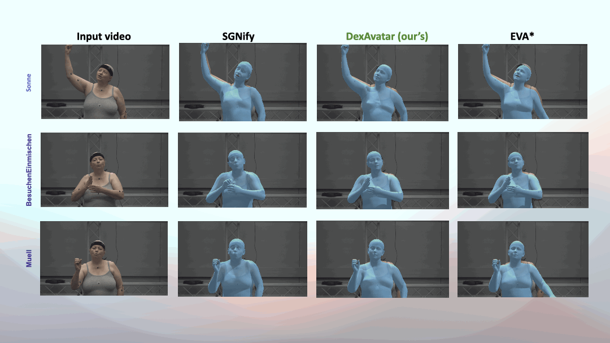

# DexAvatar: 3D Sign Language Reconstruction with Hand and Body Pose Priors [WACV 2026]

## About the project

This project is carried out at the [Human-Centered AI Lab](https://www.monash.edu/it/hcc/human-centred-ai-lab) in the [Faculty of Information Technology](https://www.monash.edu/it), [Monash University, Melbourne (Clayton), Australia](https://www.monash.edu/).

Project Members -

[Kaustubh Kundu](https://scholar.google.com/citations?user=DkDGWCYAAAAJ&hl=en) [(Monash University, Melbourne, Australia)](https://www.monash.edu/),                                                                                                                                                     
[Hrishav Bakul Barua](https://www.researchgate.net/profile/Hrishav-Barua)  [(Monash University, Australia and TCS Research, Kolkata, India)](https://www.tcs.com/what-we-do/research),                                                                                                                   
[Lucy Robertson-Bell](https://research.monash.edu/en/persons/lucy-marde-robertson-bell/) [(Monash University, Melbourne, Australia)](https://www.monash.edu/),                                                                                                                                           
[Zhixi Cai](https://scholar.google.com/citations?user=-rpiDIoAAAAJ&hl=zh-CN) [(Monash University, Melbourne, Australia)](https://www.monash.edu/), and                                                                                                                                                   
[Kalin Stefanov](https://research.monash.edu/en/persons/kalin-stefanov) [(Monash University, Melbourne, Australia)](https://www.monash.edu/)    

### <ins>Funding details<ins>

This work is supported by the prestigious [`Discovery Early Career Researcher Award (DECRA)`
](https://www.arc.gov.au/funding-research/funding-schemes/discovery-program/discovery-early-career-researcher-award-decra) fellowship by [`Australian Research Council (ARC)`](https://www.arc.gov.au/) `[Grant no. DE230100049 | Project: Towards automated Australian Sign Language translation]`. We also acknowledge Monash University and
NCI for providing High Performance Computing (HPC) infrastructure to carry out experiments.

## Overview

The trend in sign language generation is centered around
data-driven generative methods. These methods require
vast amounts of precise 2D and 3D human pose data to
achieve a generation quality acceptable to the Deaf com-
munity. However, currently, most sign language datasets
are video-based and limited to automatically reconstructed
2D human poses (i.e., keypoints) and lack accurate 3D in-
formation. However, manual production of accurate 2D
and 3D human pose information from videos is a labor-
intensive process. Furthermore, existing state-of-the-art for
automatic 3D human pose estimation from sign language
videos is prone to self-occlusion, noise, and motion blur ef-
fects, resulting in poor reconstruction quality. In response
to this, we introduce DexAvatar, a novel framework to re-
construct bio-mechanically accurate fine-grained hand ar-
ticulations and body movements from in-the-wild monocu-
lar sign language videos, guided by learned 3D hand and
body priors. DexAvatar achieves strong performance in the
SGNify motion capture dataset, the only benchmark avail-
able for this task, reaching an improvement of 35.11% in the estimation of body and hand poses compared to the state-
of-the-art.

    
     

